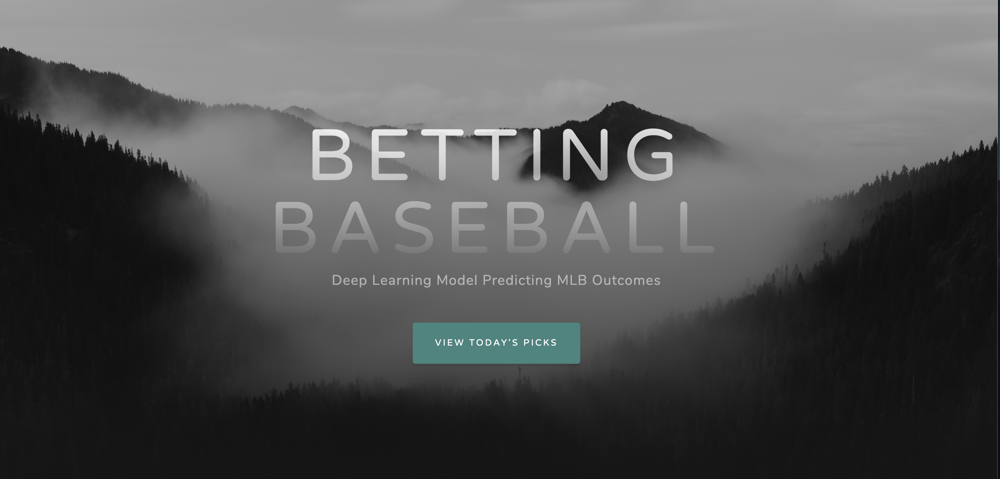
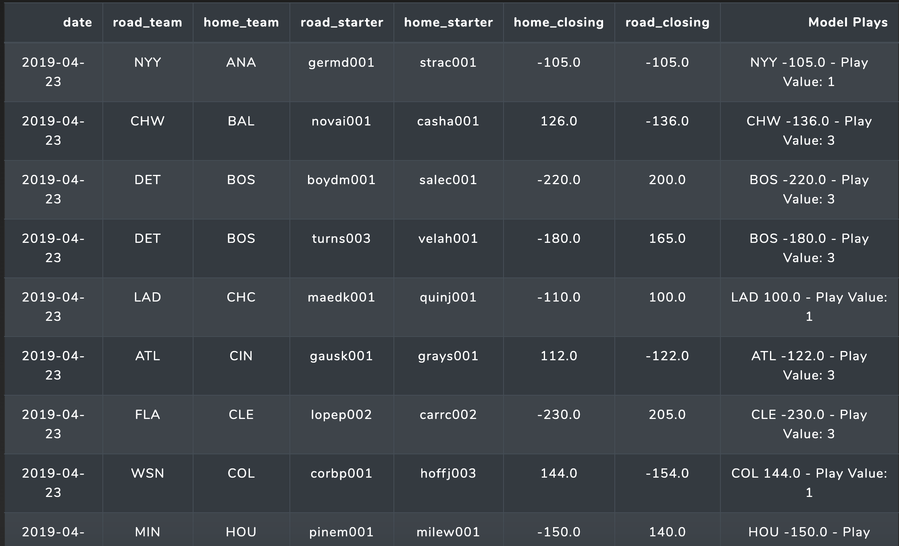

# MLB_prediction_production

This repository contains the data collection scripts as well as app deployment to AWS EC2 instance. 

The model was deployed using AWS Elastic Beanstalk with an environment built from a custom Docker image. 

The model is available here: <http://mlbdailypredictions-env.eba-cfvakqyc.us-east-2.elasticbeanstalk.com/>

The repository containing detailed initial data collection, data experimentation, and model design can be found here:
<https://github.com/asoane34/retrosheet_analysis>

Each day, data is collected and new picks are generated and displayed. As of now, the model is operating with a timedelta of 1 year - there is no baseball season due to COVID19 at the moment, so it is just resimulating last year's season (for production testing). The picks are displayed in the following format

